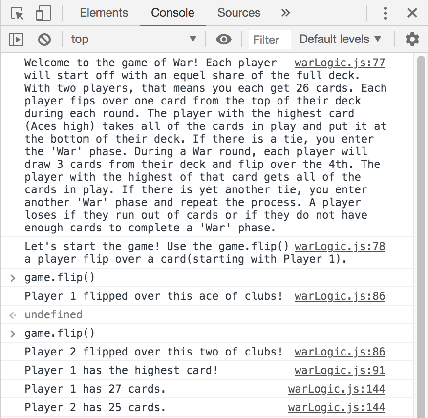

# GA SEI Project 2 - War

## Description
This is the game is my version of the classic card game, [War](https://en.wikipedia.org/wiki/War_(card_game)). It's currently set up to be played in the javascript console. It is currently set up for two players but could possible turned into a game with 3 more more players. There is currently an images folder so that the game could possible turned into a full fledged web game ([https://github.com/hayeah/playing-cards-assets](https://github.com/hayeah/playing-cards-assets)).

## Installing

Copying this repo into a director on your web server should be the only thing that you need to do to get this game running.

## Rules
Each player picks a card from the top of their deck and flips it over. The player with the highest of those cards takes all of the cards played in that hand and puts it at the bottom of their deck. If there is a tie, each player draws three cards and flips over the fourth. This round is called "War". As in a normal round, the the one with the highest cards takes all the cards played in that round and puts it at the bottom of their deck. You repeat this process if another tie occurs. A player wins when they either have all 52 cards or ther oponent does not have enough cards to finish a round of War.

## Playing the gameOver
Once you're in the console, there is only one function that you'll need to run to execute turns.

`game.flip()` will execute a players turn by flipping over a card. If a War secenario occurs, this will automatically excute. When a player runs out of cards or a player cannot finish round of War, the game will tell you that it's over. You'll need to refresh the page to begin a new game.

## Code notes

Certain areas of the code could be used in other games. Class Card and Class Deck go together to build a deck of 52 playing cards. Class Players can take that deck and split it equally depending on how many players the game has. The only class that truly relates specifically to this game is Class Game. All of these can be found in warLogic.js. The shuffle code used in the game is the [Fisher-Yates Shuffle](https://en.wikipedia.org/wiki/Fisher%E2%80%93Yates_shuffle). It's the most efficient way of shuffling an array.

## Future updates

I do plan on expanding on this game so that it runs in the browser without going into the console but the logic current works as is.
